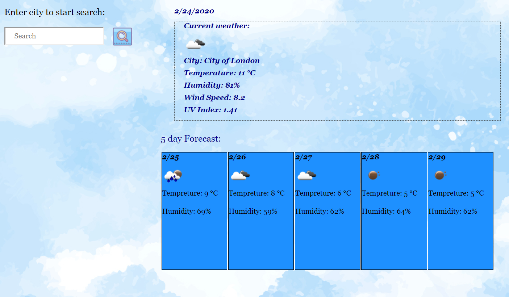
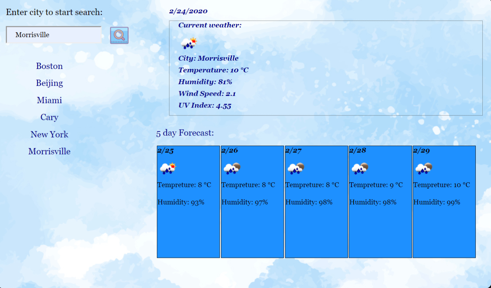

# WeatherDashBoard
**Use api call to get weather information**

This app is using api call to *https://openweathermap.org/appid* to track weather by city. It will provide the current weather information such as temperature, wind, humidity and uvindex if you enter a city name. Apart from that, it will also show 5-day forcasts for the city you entered. By default, when the page first loaded, it will show the current weather information for last entered city, which is stored in local storage.

There are three api calls are made, one is using city name as parameter to get general wether information and that specific city's latitude and longitue. Then the latitude and longitude data obtained from the prior call are used as parameters to track UV Index and fectch 5-day forcast. 

__Here is the link to display this app.__
https://mushuyun.github.io/WeatherDashBoard/ 

_For your convenience, I've taken some screen shots to give you a rough idea about the interface._

